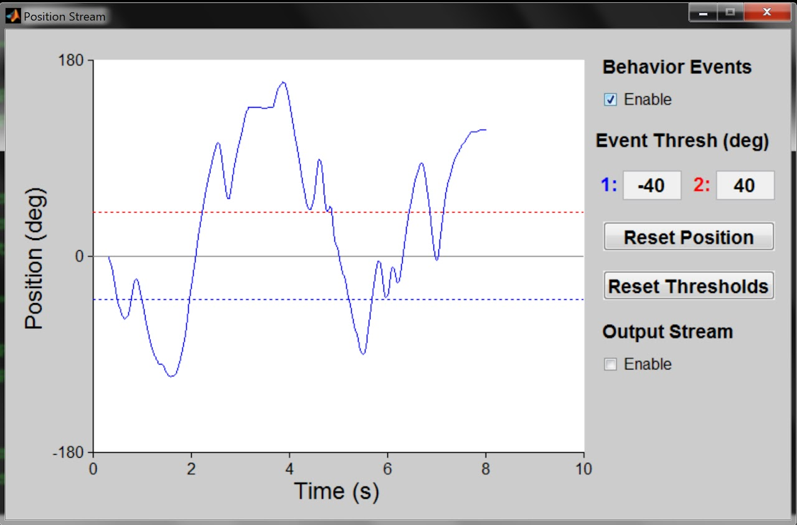
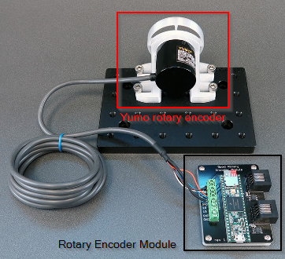

# RotaryEncoderModule()
A rotary encoder is a device that sends information related to its angular rotation. This module would be useful for tasks involving running wheels or choice wheels.

!!! important
    There are two versions of the Rotary Encoder Module with non-overlapping feature sets. Both modules are controlled by the `RotaryEncoderModule` class. Functions specific to each version are indicated with:

    - Module v1 only: :one:

    - Module v2 only: :two:

## Description

`RotaryEncoderModule()` provides an object to interface with the Bpod rotary encoder module. The rotary encoder module is optimized to integrate a 1024-position quadrature rotary encoder (e.g. Yumo E6B2-CWZ3E) with Bpod.

A `RotaryEncoderModule` object is initialized with the following syntax:
```matlab
R = RotaryEncoderModule('COM3');
```
Where COM3 is the rotary encoder module's serial port.

The rotary encoder module is controlled in 2 ways:
- Setting the `RotaryEncoderModule` object's fields
- Calling the `RotaryEncoderModule` object's functions (its methods)

## Object Fields
- **Port**
    - ArCOM Serial port object
- **thresholds**
    - An array of position thresholds (in degrees) for generating events.
        - Each trial begins at 0 degrees
        - Crossing position threshold N generates a single behavior event (byte N).
        - A crossed threshold is disabled. Disabled thresholds can be reactivated using the enableThresholds() function below.
    - By default, there are two thresholds - Threshold1 (a negative value in degrees) and Threshold2 (a positive value).
- **wrapPoint**
    - In degrees, the number of degrees moved in either direction, before the position value "wraps" to complete a circle.
    - By default, wrapPoint = 180:
        - Starting at position 0, Moving clockwise will increase the position towards 180. At 181, position wraps to -180.
            - Moving counter-clockwise will decrease the position from 0 towards -180. At -181, position wraps to +180.
            - Setting wrapPoint = 360 will require a complete rotation in each direction before the value wraps.
        - If wrapPoint is set to 0, the position will be tracked continuously in either direction, up to 32 complete rotations.
        - Thresholds cannot exceed the wrapPoint value - i.e. if wrapPoint = 180, a threshold cannot be 190 because it would never be visited.
- **sendThresholdEvents**
    - 'On' to send threshold crossing events to the Bpod state machine
    - 'Off' (default) to disable event transmission.
- **moduleOutputStream** (:one: module v1 only)
    - 'On' to stream the current position directly to a synthesis module's InputStream port (DDS, AnalogOutput).
    - 'Off' (default) to disable the module stream
- **moduleStreamPrefix** (:one: module v1 only)
    - When streaming position to a synthesis module (analog output, DDS), a character precedes each 16-bit position value.
    - By default, moduleStreamPrefix is set to 'M' - the op code for the DDS module's "mapping" function.
- **userCallbackFcn**
    - A character array containing the name of a user-created MATLAB function to call when new position data arrives via USB. The latest encoder position (in degrees) is the user function's only input argument.
- **useAdvancedThresholds** (:two: module v2 only)
    - Specifies the type of threshold used to generate behavioral events
    - 'off' to use standard position thresholds, specified by 'thresholds' property (documented above)
    - 'on' to use thresholds programmed with the setAdvancedThresholds() method (ignores 'thresholds' property above)
    - Advanced thresholds can have timing properties, and are not made current until a 'push' command is received.

## Object functions
- **currentPosition()**
    - Returns the current position of the encoder (in degrees)
- **zeroPosition()**
    - Sets the current encoder position to 0 degrees
- **setPosition(newPosition)**
    - newPosition (in degrees) sets the value of the encoder's current position
    - newPosition's absolute value cannot exceed the wrapPoint parameter (above)
- **enableThresholds(thresholdArray)**
    - thresholdArray = a binary array for each threshold in Thresholds (above), indicating whether it is enabled (1) or disabled (0).
- **startLogging()** (:one: module v1 only)
    - Starts logging the current position to the module's microSD card.
    - startLogging erases all previous data logged to the microSD card. Make sure to retrieve previously logged data with getLoggedData() before calling startLogging().
- **stopLogging()** (:one: module v1 only)
    - Stops logging the current position to the module's microSD card.
- data = **getLoggedData()** (:one: module v1 only)
    - If data was logged to the microSD card, a struct is returned containing:
        - nPositions (number of positions logged)
        - positionData (a 1 x nPositions vector of positions, in degrees)
        - timeData (a 1 x nPositions vector of times for each position measurement, in seconds)
    - If no data was logged, the function throws an error to indicate that no data was available.
- **startUSBStream()**
    - Starts streaming each new position (and corresponding time measurements) to the USB port.
    - Positions and times are stored in a buffer. The latest streaming data can be retrieved by calling readUSBStream().
    - Optionally, add argument 'UseTimer' to avoid buffer overruns if your code will not call readUSBSTream() every 100ms or so. This will start a MATLAB timer in the background to read incoming data from the buffer.
- data = **readUSBStream()**
    - If new position and time data are available in the streaming buffer, the function returns a struct containing:
        - nPositions (number of positions logged)
        - positionData (a 1 x nPositions vector of positions, in degrees)
        - timeData (a 1 x nPositions vector of times for each position measurement, in seconds)
    - If no data is available in the buffer, the function returns a struct with nPositions = 0, and empty position and time fields.
    - If startUSBStream was not called prior to calling readUSBStream, the function returns an error.
- **stopUSBStream()**
    - Stops the USB data stream previously initialized with startUSBStream().
    - The function pauses for 100ms, then clears any data that arrived in the buffer, ensuring that subsequent data transactions will work.
- **setAdvancedThresholds(**thresholds, [thresholdTypes], [thresholdTimes]**)** (:two: module v2 only)
    - optional input arguments are indicated with []
    - thresholds = an array of position thresholds in degrees. Up to 8 thresholds can be specified.
    - thresholdTypes = an array indicating the threshold type, with one value per threshold:
        - 0: Position threshold
        - 1: Threshold reached if position thresholds are NOT crossed for at least a given interval of time
    - thresholdTimes = an array indicating the timeout for each threshold if threshold type == 1
- **push()** (:two: module v2 only)
    - When advanced thresholds are loaded with setAdvancedThresholds(), they are not immediately used by the device. The next call to push() will replace the current threshold set with the most recently loaded thresholds.
    - The state machine can also push thresholds as an output action of a state (e.g. at the beginning of each trial) with the '*' command
- **streamUI()**
    - Launches a GUI to aid with setting event thresholds. Note: This GUI should be closed before running a session.
    - The GUI starts a USB stream (startUSBStream above) and plots the encoder's position (deg) v. time (s).
    - It allows you to configure and re-enable event thresholds and enable/disable the module stream.
    - The GUI is updated using a MATLAB timer, preserving access to the command line.
    - It appears as:




### Cleanup
- Clear the `RotaryEncoderModule` object with clear:
```matlab
R = RotaryEncoderModule('COM3');
% ... Use the rotary encoder module
clear R
```
- Clearing the object releases the serial port, so other applications can access it.
- If a `RotaryEncoderModule` object is created inside a MATLAB function, the object is cleared automatically when the function returns.


## Explanation of the module
This is a guide explaining how the module works, which provides a template for understanding the functions of other modules.

### What the module does


Off the shelf rotary encoder's are relatively simple devices that report a direction of movement by a certain amount. The following diagram (from the [datasheet](https://www.mouser.com/datasheet/2/307/e6b2-c_ds_csm491-25665.pdf) for the Yumo E6B2-C rotary encoders) describes the purpose of the black, white, and orange wires; the Phase A, Phase B, and Phase Z, respectively.


Each wire    can either be High or Low, and the combination of them describes the movement/position of the rotary encoder.
The black and white wires pulse once at the same time when the encoder moves enough in one direction.
However, one will pulse slightly ahead of the other depending on whether the encoder moved clockwise or anticlockwise.
The amount of movement required to trigger a pulse depends on the resolution of the rotary encoder, with a 1024 resolution encoder having 1024 ticks per 360 degrees of rotation.
The orange wire will pulse when the rotary encoder is moved through a full rotation (i.e. at the same place each time), allowing a system to monitor absolute position even if power momentarily fails.

The fact that a rotary encoder moved clockwise or anti clockwise one tick is low level information, so the rotary encoder module will take that information, convert it into degrees, and timestamp it.
That is the purpose of the rotary encoder modulefm: to provide an interface with a rotary encoder to pre-processes the data into something more usable and support more complex functions, such as a threshold system.

A [printed circuit board](https://en.wikipedia.org/wiki/Printed_circuit_board), or PCB, is essentially conductive wires printed into an insulated sheet. Rather than have a bird's nest of wires, it's much easier to have the wires statically and reproducibly embedded in a piece of plastic.

The module makes use of a [Teensy](https://www.pjrc.com/teensy/) board, a microcontroller that can be programmed with the Arduino language. The board must process the incoming wire inputs. Rather than trying to insert/solder those inputs into the Teensy directly, it's far better to connect a screw terminal into a PCB, which then "relays" the signals from the wires to the Teensy's solder pads which are soldered to the PCB.

```mermaid
---
title: Rotary Encoder Module Schematic
---
flowchart
re(rotary encoder)
pcb(rotary encoder module PCB)
module(rotary encoder module Board\n- processes TTL\n- timestamped position\n- threshold check etc.)
usb(Computer)
statemachine(State Machine)

re -- movement pulses via TTL--> pcb
pcb -- relay movement TTL --> module
module -- bytes for state machine --> pcb
pcb <-- bytes via CAT5e cable --> statemachine
module <-- ArCOM USB communication --> usb
```

### Serial interface and module class example
Let's take `RotaryEncoderModule.setPosition(newPosition)` as an example. `newPosition` is the value, in degrees, that the rotary encoder module will be set to (recall that the rotary encoder itself can only really report movement, so "position" as a value in degrees exists through calculations performed by the module's Teensy board). We can do this in MATLAB, and not have to worry about translating this request into some lower-level language that the Teensy board on the module is reading.

The `setPosition()` class method will use (aka wraps) the `ArCOMObject_Bpod.write()` method to send the sequence of bytes that the firmware has been programmed to recognise as a command to set a new postion. In this case byte 'P' followed by two bytes (16 bits) for the new position. When the module receives 'P', it recognises that the next two bytes should be interpreted as the number value for the new position.

Understanding the serial interface is important and useful because we can use the state machine to do the exact same thing.

```matlab
sma = AddState('State', 'dothing',
    'Tup', 0,
    'StateChangeConditions', {'Tup', 'nextstate'},
    'OutputActions', {'RotaryEncoder1', ['P' 'x' '1']}
)
```

In this case, the 'x' and '1' correspond to bytes 01111000 00110001 or 30769. Note that this example is only illustrative because a `newPosition` of 30769 would probably fail because it is beyond the `wrapPoint` for the module.

We could also use the Bpod Console's Manual Override to send this byte sequence manually via state machine, or indeed use `RotaryEncoderModule.Port.write()` to do so via SerialUSB.

## Example Protocol

An example Bpod protocol using the Rotary Encoder Module is given [here](https://github.com/sanworks/Bpod_Gen2/tree/master/Examples/Protocols/Wheel/Click2AFC)
